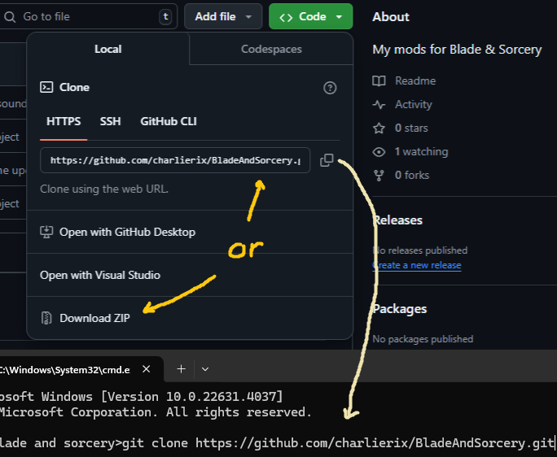
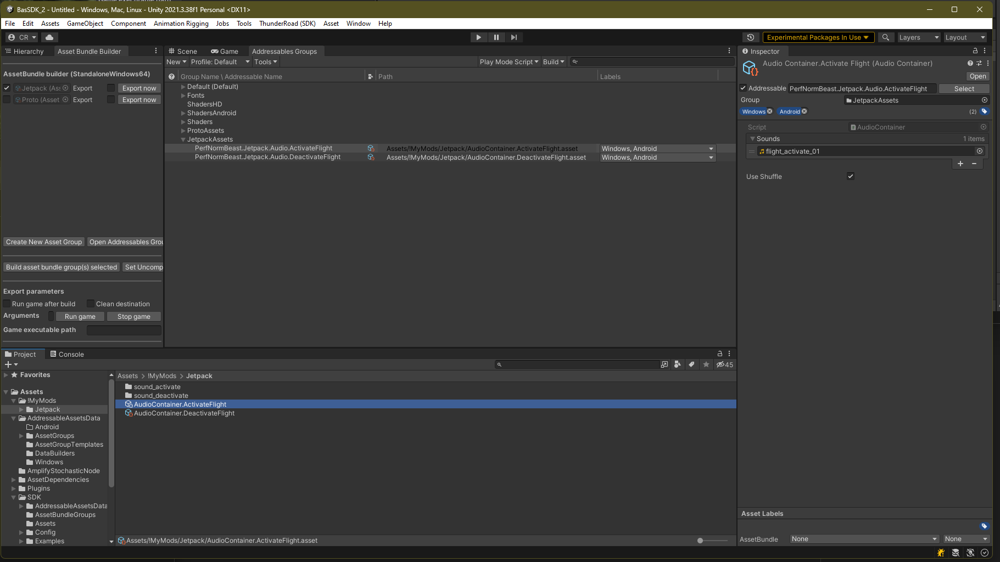
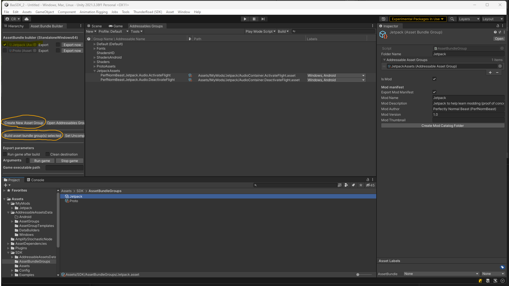
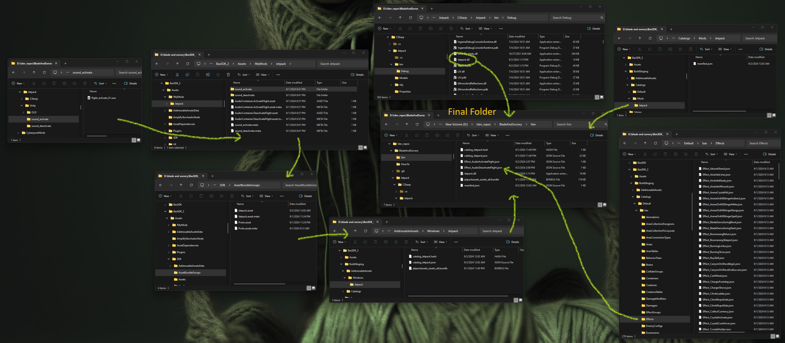

# Cloning

If you're new to git, cloning is basically downloading a copy - with an ability to push updates.  It's safe to make as my clones as you want, they're just folders on your computer, the server doesn't know about them.  So if you clone something, screw it up, but want to keep it around for reference, just clone another folder with a _2 at the end

You can either download the zip or run "git clone url" from command line.  Either way, click the root page of this repo, drop down the green button and make your selection



The folder can be anywhere.  Visual Studio defaults to something like users\name\repos\source.  Personally, I like to make a !dev_repos folder at the root of my hard drive and put all repos there.  It's easy to find and has a low risk of long folder names messing things up

If you're just going to download, there's no need for any special git tools.  But if you're going to make your own repo, create a github account.  [GitHub Desktop](https://desktop.github.com/download) is a good tool for managing repos.  You can clone directly from it, or if you've already cloned something, you can add a repo later.  VSCode and Visual Studio have git abilities as well, but I wouldn't trust visual studio when dealing with files outside of the solution

See [this](https://docs.github.com/en/get-started/getting-started-with-git/set-up-git) page for more

# Visual Studio

As I learn more, I might figure out how to do everything under the unity sdk.  But for now, the logic for a mod is in its own visual studio solution.  The sdk is just for packaging assets (sounds)

Before opening the solution, go into the .csproj file with something like [notepad++](https://notepad-plus-plus.org).  Look for all the dll references and change the path to where your blade and sorcery is installed (simple replace all of the root folder)

```xml
<Reference Include="SteamVR, Version=0.0.0.0, Culture=neutral, processorArchitecture=MSIL">
    <SpecificVersion>False</SpecificVersion>
    <HintPath>D:\SteamLibrary\steamapps\common\Blade &amp; Sorcery\BladeAndSorcery_Data\Managed\SteamVR.dll</HintPath>
</Reference>
```

After opening the solution, do a rebuild solution.  Then copy the projectname.dll from bin\debug into the folder that will be distributed to the world

# B&S SDK

Download the sdk [here](https://github.com/KospY/BasSDK)

Open [this](https://kospy.github.io/BasSDK/Components/Guides/SDK-HowTo/UnitySDKSetup.html) page to help get unity set up

# Creating Audio

### Stable Audio Tools
I use [stable-audio-tools](https://github.com/Stability-AI/stable-audio-tools) ([model](https://huggingface.co/stabilityai/stable-audio-open-1.0), [video](https://www.youtube.com/watch?v=zu1TypuTl3U)) to generate audio

### LLM
This system prompt to an LLM helps come up with the prompt to the audio generator (describe what you want, then have a conversation to refine it)

> You are an assistant that helps with sound generation prompts.  Your responses will be plugged into the text prompt of a sound effect generator.  Please try to keep the prompt to a single paragraph

If you've never done anything with LLMs, research [ollama](https://ollama.com) for the wrapper service to the llm.  After installing ollama, you'll need to download a [model](https://ollama.com/library).  But before doing that, you may want to [change](https://github.com/ollama/ollama/blob/main/docs/faq.md#where-are-models-stored) where they download to.  It can be talked to directly from command line, but is better through a ui.  I use [chatbox](https://chatboxai.app), it's simple and clean.  I also made a [tool](https://github.com/charlierix/HAL_NIN/tree/main/!playground/speech%20to%20textbox) that lets you record from microphone and paste into chatbox

### Audacity
[Audacity](https://www.audacityteam.org) is a good tool for pulling apart and modifying the wav files that were generated

# Pack Audio In Unity

## Prep
Open [this](https://kospy.github.io/BasSDK/Components/Guides/SDK-HowTo/UnitySDKSetup.html) page for detailed instructions

Along the top menu bar, click **ThunderRoad (SDK) -> Asset Bundle Builder**.  Dock that on the left next to Hierarchy tab

Then open **Window -> Asset Management -> Addressables -> Groups**.  Dock that next to the Scene and Game tabs

## Audio Group

This will create an addressable group to hold sounds representing some sound effect.  Group, because you want a bunch of slightly deviated versions of a sound randomly chosen so the mod doesn't feel cheap and annoying every time the "sound" plays.  Addressable meaning it's a unique string that can be called from any script in the game

(Most of this came from the wiki and Silk's comments)

### Files
Make a folder somewhere under Assets folder.  I made a folder called !MyMods\\modname

Make a subfolder to hold the individual wav files of a specific group

### Audio Container
Right click in the created mod folder -> **Create -> ThunderRoad -> Audio -> Audio Container**.  Name it something like AudioContainer.SoundEffectName

In the properties of the audio container, add your wav files that are sitting in the subfolder.  Be sure to check Use Shuffle

### Packed Asset Group
In the Addressables Groups tab, add an item for your mod: Right click in the tab -> **Create New Group -> Packed Assets**.  Name it your mod name

In the properties, set Build Path to DefaultBuildPath and Load Path to DefaultLoadPath (see ProtoAssets as an example)

Drag/Drop your asset into the group

Rename it inside the asset group with the pattern: Author.ModName.Audio.EffectName

Under Labels column, check Windows, Android



### Build Bundle
In the Asset Bundle Builder tab, click **Create New Asset Group**

This will be a mod level group that contains your other asset groups, so name it the same as your main

Click on the bundle, then in the properties window:

Add your assets (from Addressables Groups tab)

Also check the IsMod checkbox.  Those textboxes will be used to create the manifest.json

Check the Export Mod Manifest checkbox (it builds manifest.json, but in a different foler)

NOTE: When I changed the version to 1.0.3.0, the game didn't like it, so I had to change it back to 1.0.0.0

Click **Build asset bundle group(s) selected** button (make sure your mod is checked)

Your folder will be created in
> reponame\BuildStaging\AddressableAssets\Windows\Jetpack

manifest.json will be created in
> reponame\BuildStaging\Catalogs\Mods\modname



### Effect JSON
You also need to create an effect json file.  Here is a minimal json if all you want is audio (thanks to MagitMan).  None of the examples put author name and mod name in ID, just container address.  So I'm not sure what the scope of ID is (are mods sandboxed from each other?).  Until I know better, I'm playing it safe and using a global naming scheme

Filename: Effect_AudioActivateFlight.json

```json
{
	"$type": "ThunderRoad.EffectData, ThunderRoad",
	"id": "PerfNormBeastJetpackActivateFlight",
	"sensitiveContent": "None",
	"sensitiveFilterBehaviour": "Discard",
	"version": 0,
	"groupId": "Misc",
	"volumeDb": 0.0,
	"modules": [
		{
			"$type": "ThunderRoad.EffectModuleAudio, ThunderRoad",
			"audioContainerAddress": "PerfNormBeast.Jetpack.Audio.ActivateFlight"
		}
	]
}
```

There are example jsons here (but they are all too complicated for just doing audio)
> reponame\BuildStaging\Catalogs\Default\bas\Effects

There is also [this](https://kospy.github.io/BasSDK/Components/ThunderRoad/Effects/Effect.html) page, but it's empty

# Play Sound From Code
Here is how you play the sound from code

```csharp
Transform play_at = Player.local.transform;     // or wherever it should be played
string id = "PerfNormBeastJetpackActivateFlight";

// New every time...
Catalog.GetData<EffectData>(id).Spawn(play_at).Play();

// Or cached...
_dict = new Dictionary<string, EffectInstance>();

if (!_dict.TryGetValue(id, out EffectInstance effect))
{
    effect = Catalog.GetData<EffectData>(id).Spawn(play_at);
    _dict.Add(id, effect);
}

effect.Play();
```

# Folders / Files

Here is a picture of how various files end up in the final deployed mod folder

